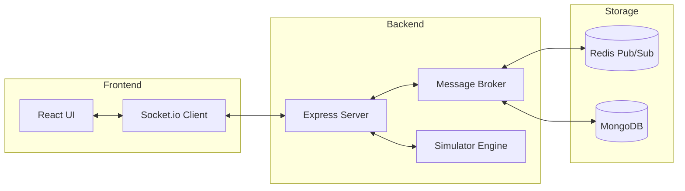

# Technical Documentation & API Reference

PubSub Fanout technical architecture and API documentation.

## Table of Contents
- [System Architecture](#system-architecture)
- [Component Details](#component-details)
- [API Reference](#api-reference)
- [WebSocket Events](#websocket-events)
- [Data Model](#data-model)

---

## System Architecture

PubSub Fanout follows a distributed messaging pattern using **Redis** for the message broker and **MongoDB** for persistence.



### Component Details

| Layer | Technology | Role |
|-------|------------|------|
| **Frontend** | React 18+ | Real-time dashboard with Canvas visualization. |
| **Backend** | Node.js / Express | API gateway, socket management, and business logic. |
| **Broker** | Redis | High-speed message distribution (Fanout). |
| **Storage** | MongoDB | Stores message history, session metrics, and logs. |
| **Simulator** | Custom Service | Generates synthetic test traffic for performance testing. |

---

## API Reference

### Base URL
`http://localhost:5000/api`

### Messages

#### `POST /messages/publish`
Publish a new message to a topic.

**Body:**
```json
{
  "topic": "orders",
  "message": { "orderId": "ORD-123", "amount": 99.99 },
  "partitionKey": "user-456" (optional)
}
```

**Response (200 OK):**
```json
{
  "success": true,
  "messageId": "msg_1234567890",
  "topic": "orders",
  "fanoutCount": 5,
  "latency": 23,
  "publishedAt": "2024-03-05T10:30:45.123Z"
}
```

#### `GET /messages/history`
Get message history for a specific topic.

**Params:** `topic`, `limit`, `skip`.

---

### Sessions

#### `GET /sessions/:sessionId`
Fetch statistics for a specific publisher or subscriber.

#### `GET /sessions`
List all active and inactive sessions.

---

### Simulation

#### `POST /simulation/start`
Starts an automated test traffic generation session.

**Body:**
| Field | Default | Range | Description |
|-------|---------|-------|-------------|
| publishers | 3 | 1-20 | Simulated publishers |
| subscribers | 10 | 1-100 | Simulated subscribers |
| duration | 60000 | 5s - 10min | Test duration (ms) |
| messageRate | 5 | 1-100 | Msgs/sec per publisher |

#### `POST /simulation/stop/:simulationId`
Force-stops a running simulation.

---

## WebSocket Events

The system uses [Socket.io](https://socket.io) for real-time bidirectional communication.

| Event | Direction | Payload | Description |
|-------|-----------|---------|-------------|
| `topic:subscribe` | Client → Server | `{ topic }` | Subscribe to receive topic messages. |
| `topic:subscribed`| Client ← Server | `{ topic, count }` | Subscription confirmation. |
| `message:new`     | Client ← Server | `{ message }` | New message pushed out (Fanout). |
| `message:publish` | Client → Server | `{ topic, payload }`| Publish via WebSocket. |
| `stats:update`    | Client ← Server | `{ stats }` | Global system updates (5s interval).|

---

## Data Model

### Message Schema
```javascript
{
  messageId: String,
  topic: String,
  partition: Number,
  partitionKey: String,
  message: Object,
  publisher: String,
  fanoutCount: Number,
  latency: Number,
  processed: Boolean,
  createdAt: ISODate
}
```

### Session Schema
```javascript
{
  sessionId: String,
  type: 'publisher' | 'subscriber',
  topics: Array,
  messageCount: Number,
  receivedCount: Number,
  avgLatency: Number,
  isActive: Boolean,
  createdAt: ISODate
}
```

---

**Last Update:** March 2026 | Version: 1.0.0
