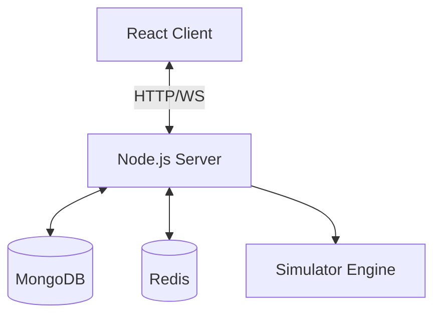

# 📡 PubSub Fanout - Real-Time Message Distribution System

A production-ready distributed messaging system with Apache Kafka-like pub/sub capabilities. Built with a Node.js backend, React frontend, MongoDB for persistence, and Redis for the message broker.

[](https://github.com/ShivaMani02/pubsub-fanout)
[](LICENSE)

## ⚡ Quick Start (5-10 Minutes)

### Option 1: Docker Compose (Easiest)
If you have Docker Desktop installed:
```bash
docker-compose up -d
# Frontend: http://localhost:3000
# Backend API: http://localhost:5000/api/health
```

### Option 2: Local Development
```bash
npm run install:all
# In separate terminals:
# 1. Start MongoDB (docker run -d -p 27017:27017 mongo)
# 2. Start Redis (docker run -d -p 6379:6379 redis)
# 3. cd server && npm run dev
# 4. cd client && npm start
```

## 🌟 Key Features

- ✅ **Real-time Pub/Sub** - Topic-based message distribution via Redis.
- ✅ **Dynamic Scaling** - Supports multiple publishers and subscribers simultaneously.
- ✅ **Persistent Storage** - MongoDB stores message history and session data.
- ✅ **Interactive Dashboard** - Visualized message flow with real-time charts.
- ✅ **Simulation Engine** - Stress test the system with automated test traffic.
- ✅ **Performance Monitoring** - Track latency, throughput, and partition load.

## 📊 System Overview

The system uses a 4-layered architecture to ensure reliability and performance.



Detailed technical details can be found in [DOCUMENTATION.md](./DOCUMENTATION.md).

## 🚀 Usage

### 1. Start a Simulation
In the dashboard **Controls** panel, click **▶️ Start Simulation**. Watch as the system generates traffic and visualizes the fanout process.

### 2. Manual Publishing
Use the **Publisher Panel** to send custom JSON payloads to specific topics.

### 3. API Access
Full REST API available at `http://localhost:5000/api`. See the [API Reference](./DOCUMENTATION.md#api-reference) for more.

## 📁 Project Structure

```bash
pubsub-fanout/
├── server/          # Node.js + Express + Socket.io
│   ├── src/config   # DB & Redis Setup
│   ├── src/pubsub   # Core Messaging Logic
│   └── src/models   # Mongoose Schemas
├── client/          # React + Socket.io Client
│   ├── src/components # Visualization Components
│   └── src/services   # API & Socket Handlers
└── docs/            # Additional documentation
```

## 🛠️ Contributing

Contributions are welcome! Please see [DEVELOPMENT.md](./DEVELOPMENT.md) for setup and coding standards.

## 📄 License

This project is licensed under the MIT License - see the LICENSE file for details.

---

**Last Update:** March 2026 | Version: 1.0.0
